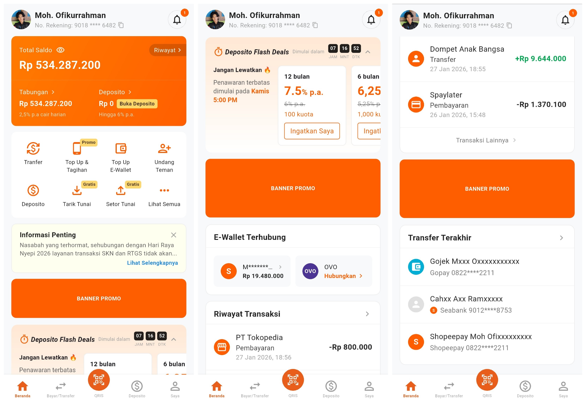

# SeaBank UI Clone - Halaman Utama (Home Page)

Aplikasi ini adalah tiruan tampilan antarmuka (UI) dari Halaman Utama (Home Page) SeaBank yang dibangun menggunakan **Flutter**. Project ini dibuat sebagai bentuk penyelesaian tugas mata kuliah Mobile Programming.

---

## Screenshot Aplikasi

Berikut adalah tampilan aplikasi saat ini (terakhir diperbarui):

  

*Gambar di atas menampilkan Halaman Utama yang terdiri dari Profile Header, Balance Card, Main Menu, Banner Info/Promo, Flash Deals, Connected E-Wallet, Transfer Terakhir, dan Riwayat Transaksi.*

---

## Konsep Flutter yang Diterapkan

Dalam pengembangan antarmuka aplikasi ini, beberapa konsep fundamental pemrograman Flutter telah dipraktikkan, antara lain:

* **Basic Widgets:** Penggunaan komponen dasar penyusun UI seperti `Text`, `Icon`, `Image`, dan `Container`.
* **Layouting:** Penyusunan tata letak yang responsif menggunakan `Row`, `Column`, `Stack`, `Padding`, `Expanded`, dan `SizedBox`.
* **Scrolling:** Implementasi gulir vertikal dan horizontal pada UI menggunakan `ListView` serta `SingleChildScrollView`.
* **Widget Tree & Composition:** Pemahaman hierarki *parent-child* menggunakan properti `child` (untuk satu elemen) dan `children` (untuk banyak elemen).
* **State & Reusability:** Pemisahan kode UI menggunakan `StatelessWidget` dan `StatefulWidget`, serta pembuatan *custom components* berparameter agar kode lebih rapi dan bisa digunakan ulang (*reusable*).
* **Styling & Decoration:** Pengaturan estetika visual menggunakan `TextStyle`, `BoxDecoration`, `ClipRRect`, dan modifikasi warna (*custom colors*).

---

## Komponen UI yang telah Dibuat

Beberapa elemen utama SeaBank yang telah diclone:

* **Profil & Header Sticky:** Navigasi atas yang diam saat di-scroll.
* **Saldo & Menu Utama:** Menampilkan saldo dummy dan ikon menu.
* **Banner Dinamis:** Banner promosi dengan ukuran yang bisa disesuaikan (*reusable*).
* **Flash Deals:** Kotak penawaran terbatas dengan penunjuk waktu.
* **E-Wallet Terhubung:** Daftar dompet digital yang tertaut.
* **Riwayat & Transfer Terakhir:** Daftar transaksi terbaru.
* **Gaya Visual:** Penyesuaian warna, ukuran teks, dan jarak agar mirip aslinya.

---

> **Catatan Penting:** Project ini semata-mata dibuat untuk **tujuan edukasi/tugas saja** dan tidak memiliki fungsi transaksi finansial sungguhan.